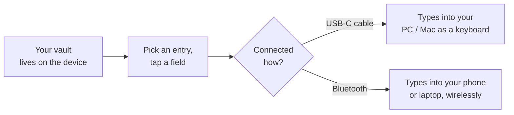
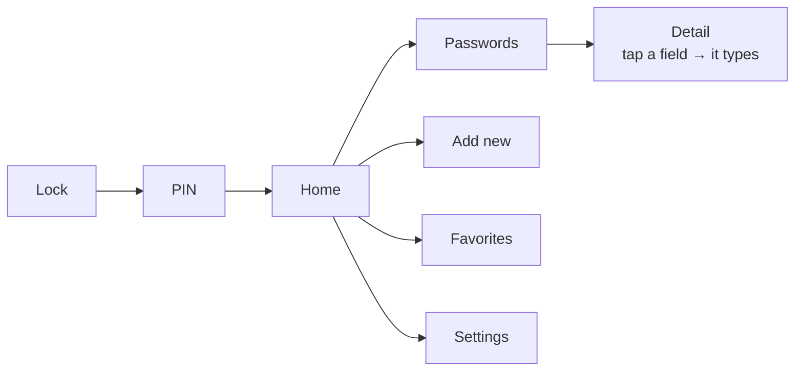
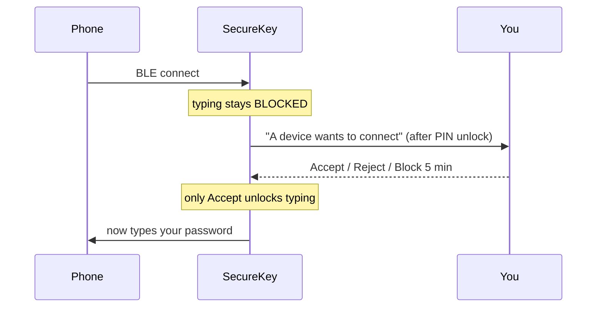

<div align="center">

# 🔐 SecureKey

### An offline, hardware password manager that **types your passwords for you** — over USB‑C *and* Bluetooth.

Built on a 1.8" AMOLED touchscreen ESP32‑S3. No cloud. No app account. Your vault never leaves the device.

[](https://www.espressif.com/en/products/socs/esp32-s3)
[](https://github.com/espressif/arduino-esp32)
[](#)
[](https://github.com/Shubhjaiswal408/SecureKey/actions/workflows/build.yml)
[](LICENSE)
[](CONTRIBUTING.md)
[](#-storage--data-model)

</div>

> **SecureKey** is a DIY [hardware password manager](https://en.wikipedia.org/wiki/Password_manager) — a tiny touchscreen "keyboard emulator." Pick an entry, tap a field, and the device types it into whatever it's plugged into (PC over USB‑C) or paired with (phone/laptop over Bluetooth). Because it presents itself as a **HID keyboard**, it works on any OS with zero drivers, zero browser extensions, and zero software installed. The secrets live in flash on the device, behind a PIN — never synced, never uploaded.

<p align="center">
  
  <br><sub><i>Illustrative renders of the on‑device UI · 368 × 448 AMOLED</i></sub>
</p>

---

## 🔑 What it does, in one picture



To the computer it just looks like someone typing — **no app, no browser extension, no account.**

---

## 🆚 How it compares

| | **SecureKey** | Cloud manager | Browser autofill |
|---|:---:|:---:|:---:|
| Where the secrets live | 🔒 on the device | ☁️ a company server | 💻 your browser profile |
| Needs an account | ❌ | ✅ | ✅ |
| Needs software on the host | ❌ | ✅ | ✅ |
| Works on any device, no install | ✅ | ❌ | ❌ |
| Usable fully offline | ✅ | ❌ | ❌ |
| Open hardware + firmware | ✅ | ❌ | ❌ |

---

## ✨ Features

| | Feature | What it does |
|---|---|---|
| ⌨️ | **Dual‑transport typing** | Types passwords as real keystrokes over **USB‑C HID** *and* **Bluetooth LE HID** — both can be live at once. |
| 🔢 | **PIN lock + brute‑force backoff** | 4‑digit unlock with escalating lockout (30 s → 60 s → 2 m → 5 m) that survives reboots. |
| 📶 | **On‑device BLE pairing gate** | A connecting phone is *blocked* until you tap **Accept** on the device. Reject, or **Block for 5 min**. Shows the peer's Bluetooth address. |
| 🗂️ | **30,000‑entry vault** | Fixed‑size binary records on FFat, with a PSRAM index so the list scrolls instantly. |
| 🔎 | **Instant search & favorites** | Live filtering with an on‑screen keyboard, plus a ❤️ favorites view. |
| 🌐 | **Wi‑Fi import/export portal** | Spin up a captive‑portal web app to bulk‑import a CSV (Chrome/Google export auto‑detected) or export your vault — code‑protected. |
| ✋ | **Drag‑to‑rearrange home** | Long‑press a home tile and drag it, just like arranging apps on a phone. Order persists. |
| 🅰️ | **Android `@` fix** | One‑tap toggle that fixes the classic US↔UK keycode swap (where `@` types as `"`) on Android hosts. |
| 🔒 | **Auto‑lock, sleep, factory reset** | Idle auto‑lock, double‑tap‑to‑sleep, PIN‑gated factory wipe, change‑PIN flow. |
| 🎨 | **Hand‑drawn AMOLED UI** | A custom, double‑buffered graphics UI (no LVGL) tuned for pure‑black AMOLED — glow effects, color avatars, pill toggles. |

---

## 🧭 Getting around



> The renders at the top show the Lock, Home, and Detail screens. Real device photos are welcome — drop them in `docs/img/` and link them here.

---

## 🧰 Hardware

| Part | Detail |
|------|--------|
| **Board** | [MaTouch ESP32‑S3 1.8" AMOLED (FT3168)](https://www.makerfabs.com/) — ESP32‑S3 R8 |
| **MCU** | ESP32‑S3, dual‑core, **8 MB OPI PSRAM**, **16 MB flash** |
| **Display** | 1.8" AMOLED, **368 × 448**, SH8601 controller over **QSPI** |
| **Touch** | FT3168 capacitive, I²C |
| **LED** | WS2812 (single RGB pixel) — status feedback |
| **USB** | USB‑C, native ESP32‑S3 (USB‑OTG / TinyUSB) |
| **Power** | USB‑C, optional 3.7 V LiPo |

---

## 🚀 Quick start

### 1. Install the toolchain (use these **exact** versions)

| Tool | Version | Where |
|------|---------|-------|
| Arduino IDE | 2.3.x | [arduino.cc](https://www.arduino.cc/en/software) |
| `esp32` boards core | **2.0.16** | Boards Manager — do **not** use 3.x |
| GFX Library for Arduino | **1.3.7** | Library Manager |
| NimBLE‑Arduino | **1.4.3** | Library Manager — do **not** use 2.x |
| ESP32 BLE Keyboard (T‑vK) | latest | Library Manager *(+ 2 small patches, below)* |
| Adafruit NeoPixel | latest | Library Manager |

Add this Boards Manager URL first (**File → Preferences → Additional URLs**):
```
https://raw.githubusercontent.com/espressif/arduino-esp32/gh-pages/package_esp32_index.json
```

### 2. Patch the BLE keyboard library (two one‑line edits)

The stock **ESP32 BLE Keyboard** ships with the heavyweight Bluedroid backend and MITM‑required pairing, which break USB+BLE coexistence and silent‑fail on Windows/Android. In your `…/Arduino/libraries/ESP32_BLE_Keyboard/` copy:

```diff
// BleKeyboard.h
- // #define USE_NIMBLE
+ #define USE_NIMBLE          // half the RAM; coexists with native USB HID

// BleKeyboard.cpp  (inside begin(), the USE_NIMBLE branch)
- BLEDevice::setSecurityAuth(true, true, true);
+ BLEDevice::setSecurityAuth(true, false, true);   // SC "Just Works" pairing
```

### 3. Arduino IDE board settings (Tools menu)

```
Board:              ESP32S3 Dev Module
PSRAM:              OPI PSRAM                       ← REQUIRED (canvas lives here)
Flash Size:         16MB (128Mb)
Partition Scheme:   16M Flash (3MB APP/9.9MB FATFS)
USB CDC On Boot:    Enabled
USB Mode:           USB-OTG (TinyUSB)               ← REQUIRED for USB HID typing
Upload Mode:        UART0 / Hardware CDC
CPU Frequency:      240MHz
Flash Mode:         QIO 80MHz
```

### 4. Flash

Open `06_PasswordManager/06_PasswordManager.ino` and Upload. First boot seeds a few demo entries so you can see the UI immediately.

<details>
<summary><b>Prefer the command line? (arduino-cli)</b></summary>

```bash
arduino-cli compile \
  --fqbn "esp32:esp32:esp32s3:PartitionScheme=app3M_fat9M_16MB,PSRAM=opi,FlashSize=16M,USBMode=default,CDCOnBoot=cdc" \
  06_PasswordManager
```
(`USBMode=default` is USB‑OTG/TinyUSB.) This is exactly what the [CI workflow](.github/workflows/build.yml) runs on every push.
</details>

### 5. First unlock

There's no default PIN. First boot walks you through choosing your own PIN
(4/6/8 digits — 6+ recommended), which is used to derive the key that
protects your vault and is never itself stored on the device. See
[docs/SECURITY.md](docs/SECURITY.md) for how this works.

---

## 🕹️ Using it

1. **Tap to wake → enter PIN → Home.**
2. Open **Passwords**, tap an entry.
3. On the detail screen, **tap any field** (Title / User / Pass / URL / Note) — SecureKey **types it** into the focused field on your computer/phone.
4. Password is masked; first tap reveals it, second tap types it.
5. **Bottom bar:** `EDIT` · ❤️ · `DELETE`.

**To type over USB:** plug the USB‑C into a PC data port → tap a field. **To type over Bluetooth:** Settings → turn on Bluetooth → pair "SecureKey" from your phone → unlock the device → tap **Accept** on the request → tap a field.

> 💡 If `@` comes out as `"` on Android, enable **Settings → Android @ Fix**.

---

## 🧠 Feature concepts (how it actually works)

A short tour of the interesting engineering. For the full deep dive see **[docs/ARCHITECTURE.md](docs/ARCHITECTURE.md)**.

### ⌨️ HID — "the device *is* a keyboard"
Both USB and Bluetooth expose a standard **[HID keyboard](https://en.wikipedia.org/wiki/USB_human_interface_device_class)**. The OS sees a normal keyboard, so typing works everywhere with no software. The firmware sends **scancodes**, and the host applies its own keyboard layout — which is why the Android `@`→`"` swap exists (see below).

### 🔀 Dual transport on a dual‑core chip
USB HID uses **TinyUSB**; Bluetooth HID uses **NimBLE** (chosen over Bluedroid because it uses ~half the RAM and coexists with native USB). The ESP32‑S3 has two cores and NimBLE runs its own radio task, so **both transports can be live simultaneously** — `typeViaHID()` sends to *every* ready transport instead of picking one.

### 📶 The Bluetooth pairing gate
A BLE *central* (your phone) can connect to the device any time, but SecureKey **types nothing until you physically accept it** on‑screen — and the prompt only appears *after* you've entered your PIN. You can **Accept**, **Reject** (snoozes the prompt so an auto‑reconnecting phone doesn't nag), or **Block 5 min** (drops the radio). The prompt shows the peer's Bluetooth MAC. *(A BLE central doesn't transmit a friendly name to a keyboard, so the address is what's identifiable.)*



### 🔑 The Android `@`→`"` fix
HID sends key *positions*, not characters. On a host set to a UK/Android layout, `Shift+2` is `"` (not `@`), and `@` lives on `Shift+'`. The **Android @ Fix** toggle swaps those two keycodes on the BLE path so symbols land correctly — the classic US↔UK keyboard difference, solved in firmware.

### 🗂️ Storage: flat binary + PSRAM index
The vault is **fixed‑size 256‑byte records** appended to a single FFat file (`db.bin`). At boot a compact 64‑byte **index** per entry is loaded into **PSRAM**, so searching, sorting, and scrolling never touch flash. Deletes are tombstoned; edits rewrite in place. This scales to **30,000 entries** (≈1.9 MB index in PSRAM, ≈7.3 MB on the 9 MB FAT partition).

### 🛡️ PIN lockout backoff
Wrong PINs trigger an **escalating, persisted** lockout (30 s → 60 s → 2 m → 5 m). The fail count lives in NVS, so power‑cycling doesn't reset the penalty — a brute‑force attacker can't just yank power to retry instantly.

### 🌐 Wi‑Fi import/export portal
Bulk data entry on a touchscreen is painful, so Settings can launch a **SoftAP + captive‑portal web app**. You join its Wi‑Fi, open the page, enter a one‑time code, and paste a CSV (Chrome/Google password exports auto‑detected) or export your vault. Every entry requires title + username + password — enforced both in the browser and server‑side.

### ✋ Drag‑to‑rearrange home (touch state machine)
The FT3168 driver feeds a tap/drag/swipe state machine. A **long‑press** on a home tile lifts it; it follows your finger; on release it drops into the nearest slot and the others shuffle to make room. The arrangement is saved to NVS and validated as a permutation on load.

### 🎨 Rendering on pure‑black AMOLED
The UI is hand‑drawn into a **double‑buffered canvas** in PSRAM and flushed over QSPI — no LVGL, no flicker. Because AMOLED black is truly off, the theme leans into **glow halos** (banded radial gradients), color **letter‑avatars**, and a blue/red accent system on black.

---

## 🗺️ Architecture

```
06_PasswordManager/
├── 06_PasswordManager.ino   Main: setup/loop, nav stack, HID dispatch, BLE gate, auto-lock
├── theme.h                  Palette, layout constants, PassRecord + ListItem structs, capacity
├── pin_config.h             Board pin map (display, touch, LED, USB)
│
├── hid_usb.cpp              USB-HID keyboard (TinyUSB)            ← isolated translation unit
├── hid_ble.cpp              BLE-HID keyboard (NimBLE) + @ fix     ← isolated translation unit
│
├── storage.ino             FFat binary DB: append/load/delete/update/seed
├── touch_input.ino         FT3168 reader + tap/drag/swipe/long-press state machine
├── gfx_lib.ino             Drawing helpers: text, icons, glow, avatars, status/nav bars
├── keyboard.ino            On-screen keyboard (search + add/edit)
│
├── screen_lock.ino         Branded lock screen
├── screen_pin.ino          4-digit keypad + lockout countdown
├── screen_home.ino         Home grid + drag-to-reorder
├── screen_list.ino         Virtual-scroll list + inline search + favorites
├── screen_detail.ino       Entry detail + Edit/Fav/Delete + tap-to-type
├── screen_add.ino          Multi-step add / edit form
├── screen_settings.ino     Settings, HID test, About, factory reset
├── screen_chgpin.ino       Change-PIN flow
├── screen_wifi.ino         Wi-Fi import status screen
├── wifi_portal.ino         SoftAP + HTTP server (import/export)
└── portal_html.h           The captive-portal single-page web app
```

> ⚠️ **USB & BLE keyboard libraries each `#define KEY_*` macros**, so they cannot share a translation unit. That's why `hid_usb.cpp` and `hid_ble.cpp` are separate `.cpp` files exposing a tiny `extern "C"` surface to the `.ino` code.

---

## 🔐 Security model & honest limitations

Full write‑up (threat model, cryptographic design, migration, and the exact
ESP32‑S3 Flash Encryption / Secure Boot production steps) lives in
**[docs/SECURITY.md](docs/SECURITY.md)**. Summary:

**What it does today**
- Vault is **offline**, PIN‑gated, and **encrypted at rest**: every record is
  AES‑256‑GCM with its own random nonce, under a random 256‑bit master key
  that is itself wrapped by a PBKDF2‑HMAC‑SHA256‑derived key — never the PIN
  directly, and the PIN is never stored anywhere, in any form.
- The screen locks on idle and on the physical button; locking wipes the
  master key from RAM, not just the display.
- Brute‑force PIN backoff persists across reboots, on top of the real KDF
  cost every guess pays regardless of that counter.
- Bluetooth typing requires **explicit on‑device approval** per connection.
- Factory reset destroys the old cryptographic identity entirely (new random
  master key, new salt) — it can't be used to bypass the PIN and recover an
  old vault.
- An existing plaintext vault (pre‑encryption firmware) migrates
  automatically on first boot of this firmware, with a verify‑before‑delete
  step so the old data is never lost to a failed migration.

**What it does *not* do** (see SECURITY.md § Security limitations for the
full list)
- Optional **ESP32‑S3 Flash Encryption + Secure Boot v2** (whole‑flash /
  firmware‑signing hardening on top of the above) is documented but **not
  auto‑enabled** — it's a manual, explicit, one‑way eFuse step you run
  yourself when you're ready for a production device, never something the
  build or firmware does for you.
- A compromised or *currently unlocked* device, sophisticated hardware
  attacks (glitching, side‑channel), and firmware bugs elsewhere in the
  codebase are outside what this (or any) microcontroller password manager
  can fully defend against.

Treat this as a **serious DIY / hobbyist‑grade hardened project**, not a
certified security product — see the roadmap.

---

## 🛣️ Roadmap

- [x] Touch UI, vault, USB + BLE HID, Wi‑Fi import, drag‑reorder
- [x] **AES‑256‑GCM encrypted vault** (random master key, PBKDF2‑derived PIN wrapping — see [docs/SECURITY.md](docs/SECURITY.md))
- [ ] **Flash Encryption + Secure Boot v2 enabled by default in a documented production build** (the steps are written up in SECURITY.md today; still a manual per‑device process, not yet a one‑command flow)
- [ ] **TOTP / 2FA** code generator (HMAC‑SHA1)
- [ ] **FIDO2 / WebAuthn** passkey (ECC P‑256)
- [ ] Custom PCB + 3D‑printed enclosure

---

## 🤝 Contributing

Contributions, bug reports, and hardware ports are welcome — see **[CONTRIBUTING.md](CONTRIBUTING.md)**. The CI compiles the firmware on every push, so make sure your branch builds green.

## 📜 License

[MIT](LICENSE) © Shubh Jaiswal.

## 🙌 Credits

- [Makerfabs](https://www.makerfabs.com/) — MaTouch ESP32‑S3 AMOLED hardware
- [moononournation/Arduino_GFX](https://github.com/moononournation/Arduino_GFX) — display driver
- [h2zero/NimBLE‑Arduino](https://github.com/h2zero/NimBLE-Arduino) — lightweight BLE stack
- [T‑vK/ESP32‑BLE‑Keyboard](https://github.com/T-vK/ESP32-BLE-Keyboard) — BLE HID keyboard
- [adafruit/Adafruit_NeoPixel](https://github.com/adafruit/Adafruit_NeoPixel) — WS2812 LED

<div align="center">

**If this project helped you, drop a ⭐ — it genuinely helps.**

</div>
